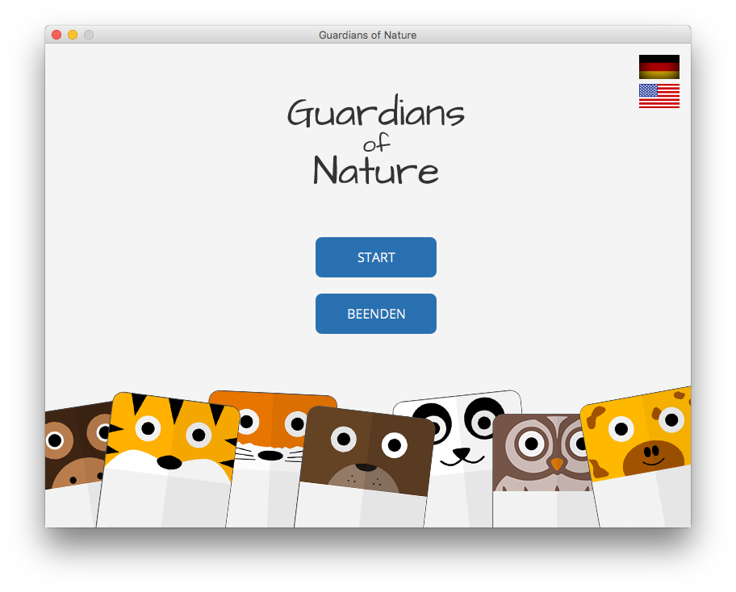
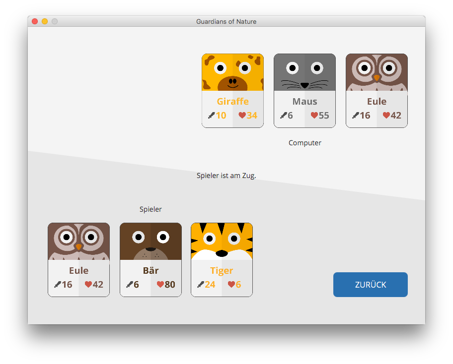

# Guardians of Nature

A simple card game, written in Java. Every player choose three cards with different attack and health values. The aim of the game is to attack the opponent until he has no more cards.

## Screenshots






## Compile and run

```bash
# Install ant on Mac OSX
brew update
brew install ant

# Create and run jar file
ant

# Cleanup output directory and create jar file
ant clean-build
```
